

# 🌌 PLANETARY SYSTEMS

## Table of Contents

Contents

1. [📖 About The Project](#about_the_project)
    - [📋 Summary](#summary)
    - [🔧 built With](#built_with)
2. [❔ Getting Started](#getting_started)
    - [🖥️ Installation](#installation)
3. [🕸️ Website](#website)
4. [📱 Mobile Website \*\*in dev\*\*](#mobile_web)
5. [📉 Plotted Graphs](#plots)
    - [🌍 Occurrence Of Planetary Systems By Star System Type](#plot1)
    - [🌏 Planetary Systems by Star Count](#plot2)
    - [🌎 Most Common Planetary Systems](#plot3)
6. [📡 Acknowledgements](#acknowledgements)
7. [📧 Contact](#contact)

<!-- 🌠☄️👩‍🚀👩‍💻👩‍🔬💬💭🥼📻🔍📷📃📝✒️📊📆🗃️🪐 -->

## 📖 About The Project

### 📋 Summary:
This Project consists of multiple programs:
#### Data Collection Program
A program that runs multiple other programs, which gather planetary and stellar host data from various NASA's Exoplanet Archive tables via TAP request using ADQL which is then organised, cleaned and saved into relevant tables in a local sqlite3 database. Lastly a program that is made with pandas and matplotlib to analyse, visualise and save system data in figures.
- Python, Astroquery (TapPlus), Sqlite3, Pandas, Matplotlib, Pytest, ADQL

#### Web Program
A website application that represents planetary and system data to the user.
- Python, OOP, Flask, HTML, CSS, Pytest

### 🔧Built with

- 🌌 [Astropy & Astroquery](https://astroquery.readthedocs.io/en/latest/index.html)
    - ADQL 
- 🪐 [Jupyter Notebooks](https://docs.jupyter.org/en/stable/install.html)
- 📊 [Matplotlib](https://matplotlib.org/stable/install/index.html)
- 🔢 [Numpy](https://numpy.org/install/)
- 🐼 [Pandas](https://pandas.pydata.org/docs/getting_started/install.html)
- 🐍 [Python](https://www.python.org/downloads/)
    - [Flask](https://flask.palletsprojects.com/en/stable/)
    - [Pytest](https://docs.pytest.org/en/stable/)
    - html & css
- 🌿 [Sqlite3](https://www.sqlite.org/)
- 💠 Visual Studio Code

## ❔ Getting Started

### 🖥️ Installation

Installation steps

1. Fork this repository
    - git clone https://github.com/rachaellampardfrance/Exoplanetary_Systems
2. Install requirements.txt

        $pip install -r requirements.txt

## 🕸️ Website

### Homepage
Displays many planets and planetary systems are confirmed

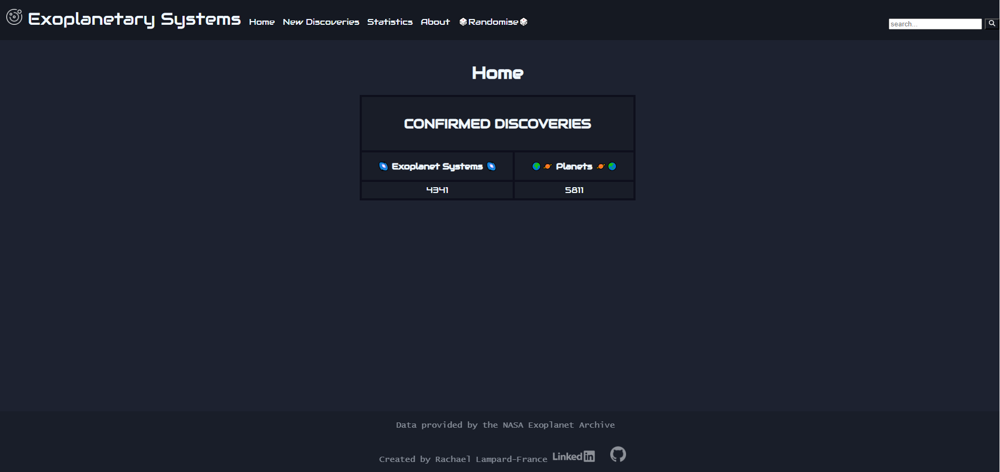

### New Discoveries
Display newly discovered planets and recently updated systems.
- Page has the option to show new planets, system updates tables or both.
    - New planets: planetary discoveries
    - System updates: an existing planetary system that has had a new planet discovered
- Any of the planets, stars(hosts), or systems may be clicked on to lead the user to the dynamic '/system/<stellar_body>' page which will display information about the system the stellar body is in. 

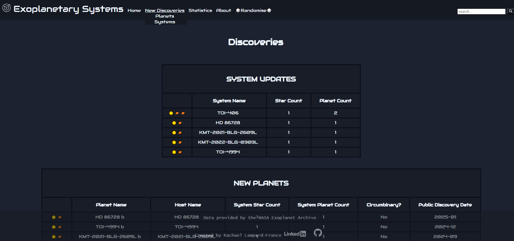

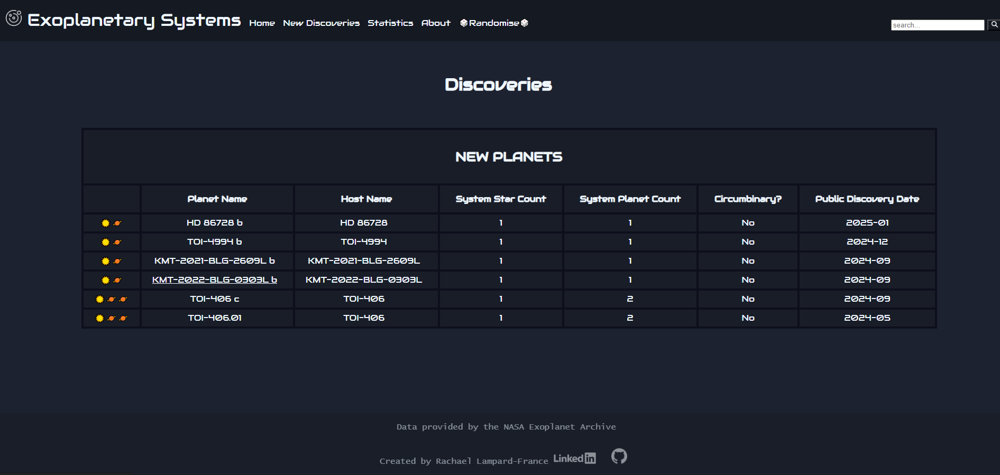

### Statistics
Display statistic figures created from the gathered database information

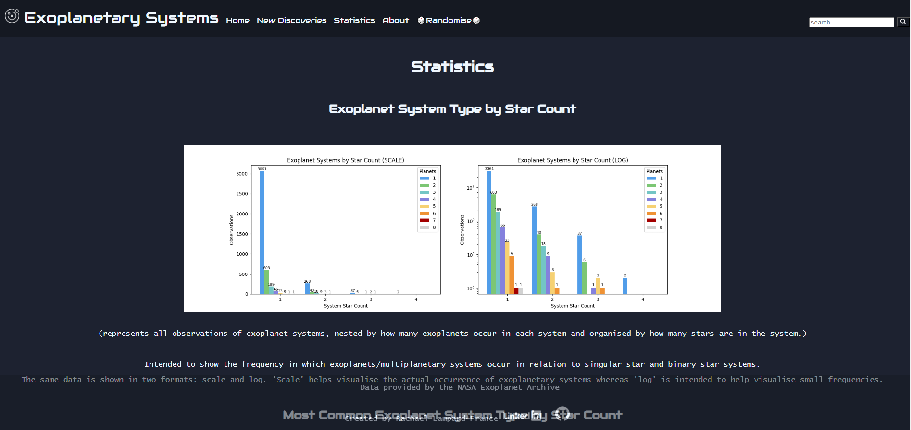

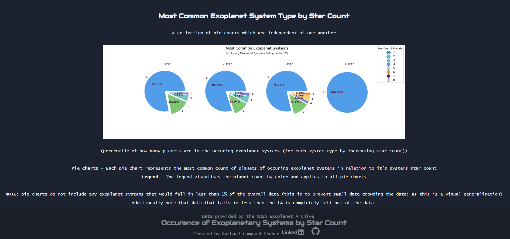

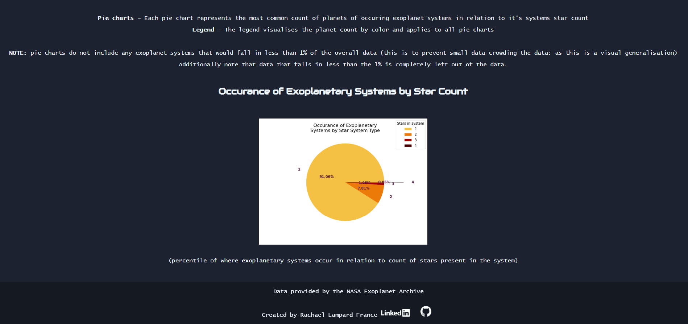

### About
Description of project and Acknowledgments

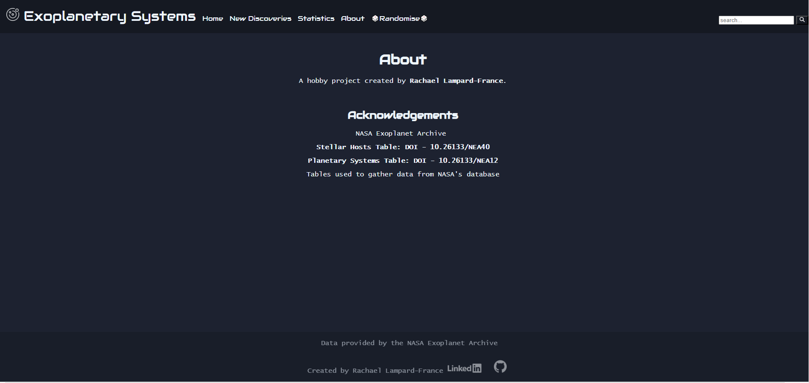

### 🎲Randomise🎲
This route generates a Redirect the user to the System page with a random 

### System
A page that displays System information to the user, either navigated to by the search bar or by clicking on a stellar body. This page will display the system of any given planet, star or system that is in the database.

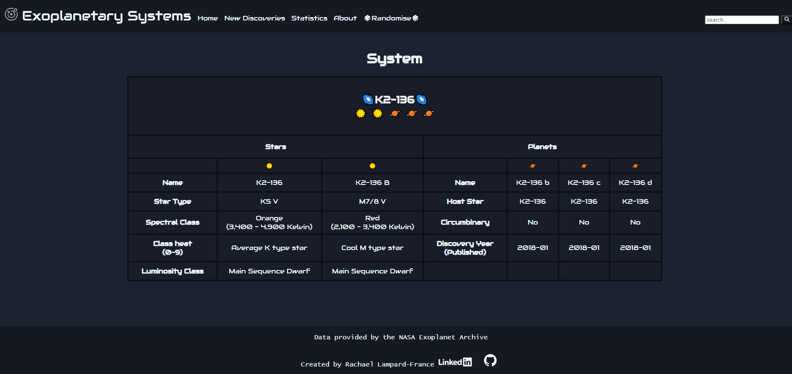

### Suggestions
If the users system search is unsuccessful (as in no planet, star or system is found to be a match) the user will be redirected to this 'Suggestions' page.

#### Partial match
Page displays suggested planets, stars or systems. (If their text pattern is found in any existing stellar body name.)

#### No match
Page displays "No suggestions available"

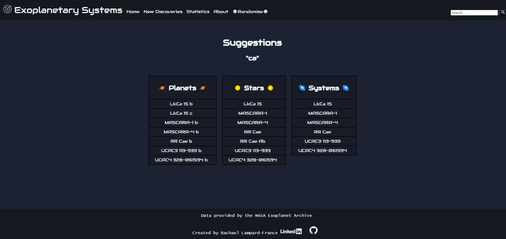

## Mobile \*\*In Development\*\*

### 
Statistics page

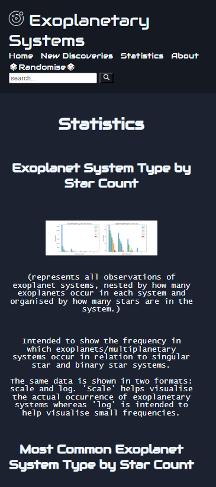
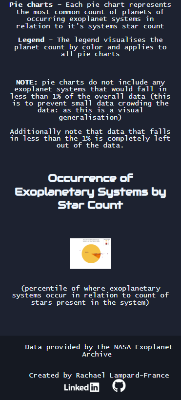

### 
System page

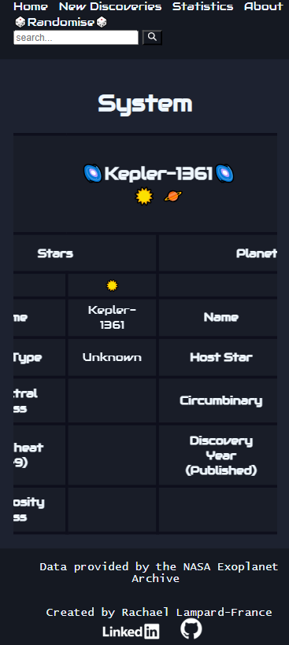

## 📉 Plots

Plots

The program creates three plot figures...

#### 🌍**1. Occurrence Of Planetary Systems By Star System Type:**

Intent:
A pie chart representation of what type of systems planets most commonly occur in relation to how many stars are within the system.

Contents:
- Figure
    - Pie chart - *represents data of what systems planets most commonly occur in, related to how many stars are in the system.*
    - Legend - *displays how many stars are in each system on the pie chart related by color.*
    - Additional planetary discovery data - *extra data displayed on the figure represents how many confirmed planetary systems have been discovered as well as individual exoplanets.*

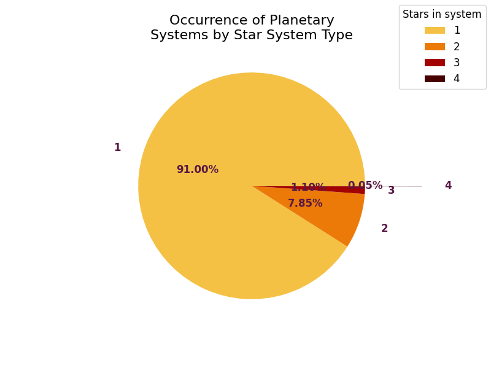

#### 🌏**2. Planetary Systems by Star Count:**

Intent:
A figure containing two nested bar charts that represent all observations of exoplanet systems, nested by how many planets occur in each system and organised by how many stars are in the system. This is intended to show the frequency in which exoplanets/multi-planetary systems occur in relation to singular star and binary star systems.

The same data is shown in two formats: scale and log. 'Scale' helps visualise the actual occurrence of planetary systems whereas 'log' is intended to help visualise small frequencies.

Contents:
- Figure
    - Nested bar chart - *represents all observations of planetary systems, nested by how many planets occur in each system and organised by how many stars are in the system.*
    - Nested bar chart LOG - *represents the same data as above but in a log format to help visualise small data*

#### 🌎**3. Most Common Planetary Systems:**

Intent:
A collection of pie charts which are independent of one another, each corresponding to a type of star/binary star system. Each pie chart represents which is the most common type of planetary system in relation to the star system.

>[!NOTE] These pie charts do not include any planetary systems that would fall in less than 1% of the overall data (this is to prevent small data crowding the data: as this is a visual generalisation)
>
>Additionally note that data that falls in less than the 1% is completely left out of the data.

Contents:
- Figure
    - Pie charts - *Each pie chart represents which is the most common type of planetary system in relation to it's systems star count*
    - Legend - *The legend visualises the planet count by color and applies to all pie charts*

## 📡 Acknowledgements

- 🚀 [NASA's Exoplanet Archive](https://exoplanetarchive.ipac.caltech.edu)
    - ***Stellar Hosts Table DOI:* 10.26133/NEA40**
    - ***Planetary Systems Table DOI:* 10.26133/NEA12**

- 🔭 [Astroquery](https://ui.adsabs.harvard.edu/abs/2019AJ....157...98G/abstract)

## 📧 Contact

###  Creator: Rachael Lampard-France

<!--  -->

Project Link - https://github.com/rachaellampardfrance/Exoplanetary_Systems

[return to top](#top)
