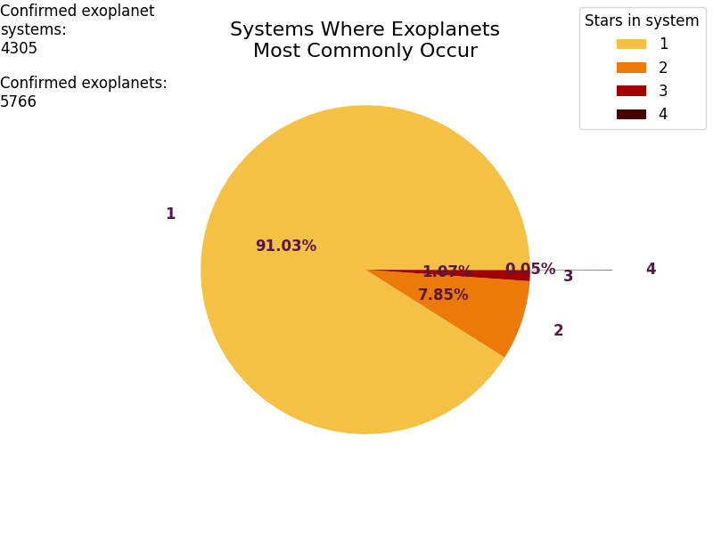
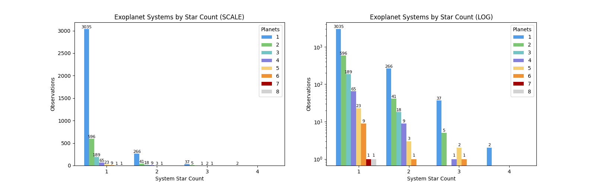

# EXOPLANETARY SYSTEMS

Table of Contents

## Table of Contents
1. [About The Project](#about_the_project)
    - [Summary](#summary)
    - [built With](#built_with)
2. [Getting Started](#getting_started)
    - [Prerequisites](#prerequisites)
    - [Installation](#installation)
3. [Usage](#usage)
4. [Acknowledgements](#acknowledgements)
5. [Contact](#contact)

## About The Project

### Summary:
This program is intended to get star system data from NASA's 'stellar hosts' database via TAP request using ADQL. Then the data is organised and cleaned down to the unique star systems required Ready for analysis, the data is then organised into new data frames to plot various visual graphs...

### Built with
- Astroquery
    - ADQL 
- Juptyer NoteBooks
- Numpy 
- Matplotlib
- Pandas
- Python

## Getting Started

### Prerequisites

packages

#### [Astropy & Astroquery](https://astroquery.readthedocs.io/en/latest/index.html)

    $ pip install astropy astroquery

#### [Jupyter](https://docs.jupyter.org/en/stable/install.html)

    $ pip install jupyter

#### [Matplotlib](https://matplotlib.org/stable/install/index.html)

    $ pip install matplotlib

#### [Numpy](https://numpy.org/install/)

    $ pip install numpy

#### [Pandas](https://pandas.pydata.org/docs/getting_started/install.html)

    $ pip install pandas

#### [Python](https://www.python.org/downloads/)

    Download Python3 

### Installation
how to install the program...

## Usage

This program is written in 'Jupyter NoteBooks' in Python and Markdown. The program is designed to make a request to NASA's astronomical Database using a TAP Plus request (Similar to an API request but the TAP protocol is a standard for the astronomical community).

Firstly a TapPlus class instance is created to carry out the TAP request to NASA's database. A query variable is made with an ADQL string. Then a synchronous job is carried out as a function on the TapPlus class instance, with the ADQL query passed in as an argument. This makes the ADQL request and returns a job object with a VOTable table format.

For the first request it gets the schema of the database we are interested in getting data from, as there are over 100 columns to the 'Stellar Hosts' database the information is truncated. For this reason the program saves the table as a .csv file we can read so that we can search through to find the columns of data we will be interested in.
> This request is synchronous as it is a smaller request of information. Asynchronous requests are made for larger amounts of data otherwise it would not receive all of the data

Then the data is sorted alphabetically and any duplicate data is removed by system (as the database has a lot of repeated systems as it records individual stellar bodies within the systems)

Once the data is cleaned three data sets are created...

### data sets

- **system_df:**
    - A large pandas dataframe containing all systems names, star number and planet number within the system.  
    - Created from the cleaned data from NASA's 'Stellar Hosts' database
   

- **star_srs:**
    - A small pandas series with the 'system star count' as the index and the occurrence that exoplanets have been observed in the system type *(not all exoplanets - the occurrence of a system containing exoplanets)*.
    - Created from the 'system_df'

- **planet_to_star_df:**
    - A small pandas dataframe with the 'system star count' as the index and divided into additional 'exoplanet count' columns by system, the data relates to observed occurrences.
    - Created from the 'system_df'

Once the data required is organised three plots are visualised using the data...

### Plotted Graphs

Plots

The program creates three plot figures...

#### 1. Systems Where Exoplanets Most Commonly Occur:

Intent:
> A pie chart representation of what type of systems exoplanets most commonly occur in relation to how many stars are within the system.

Contents:
- Figure
    - Pie chart - *represents data of what systems exoplanets most commonly occur in, related to how many stars are in the system.*
    - Legend - *displays how many stars are in each system on the pie chart related by color.*
    - Additional exoplanet discovery data - *extra data displayed on the figure represents how many confirmed exoplanet systems have been discovered as well as individual exoplanets.*

#### 2. Exoplanet Systems by Star Count:

Intent:
> A figure containing two nested bar charts that represent all observations of exoplanet systems, nested by how many exoplanets occur in each system and organised by how many stars are in the system. This is intended to show the frequency in which exoplanets/multiplanetary systems occur in relation to singular star and binary star systems.
>
> The same data is shown in two formats: scale and log. 'Scale' helps visualise the actual occurrence of exoplanetary systems whereas 'log' is intended to help visualise small frequencies.

Contents:
- Figure
    - Nested bar chart - *represents all observations of exoplanet systems, nested by how many exoplanets occur in each system and organised by how many stars are in the system.*
    - Nested bar chart LOG - *represents the same data as above but in a log format to help visualise small data*

#### 3. Most Common Exoplanet Systems:

Intent:
> A collection of pie charts which are independent of one another, each corresponding to a type of star/binary star system. Each pie chart represents which is the most common type of exoplanet systems in relation to the star system.
>
> [!NOTE]
> These pie charts do not include any exoplanet systems that would fall in less than 1% of the overall data (this is to prevent small data crowding the data: as this is a visual generalisation)
>
> Additionally note that data that falls in less than the 1% is completely left out of the data.

Contents:
- Figure
    - Pie charts - *Each pie chart represents which is the most common types of exoplanet systems in relation to it's systems star count*
    - Legend - *The legend visualises the planet count by color and applies to all pie charts*

## Acknowledgements

- [NASA's Exoplanet Archive](https://exoplanetarchive.ipac.caltech.edu): All data is gathered from NASA's 'Stellar Hosts' database 
    - **DOI: 10.26133/NEA40**

- [Astroquery](https://ui.adsabs.harvard.edu/abs/2019AJ....157...98G/abstract)

## Contact

Creator: Rachael Lampard-France

Project Link - 

[return to top](#top)
